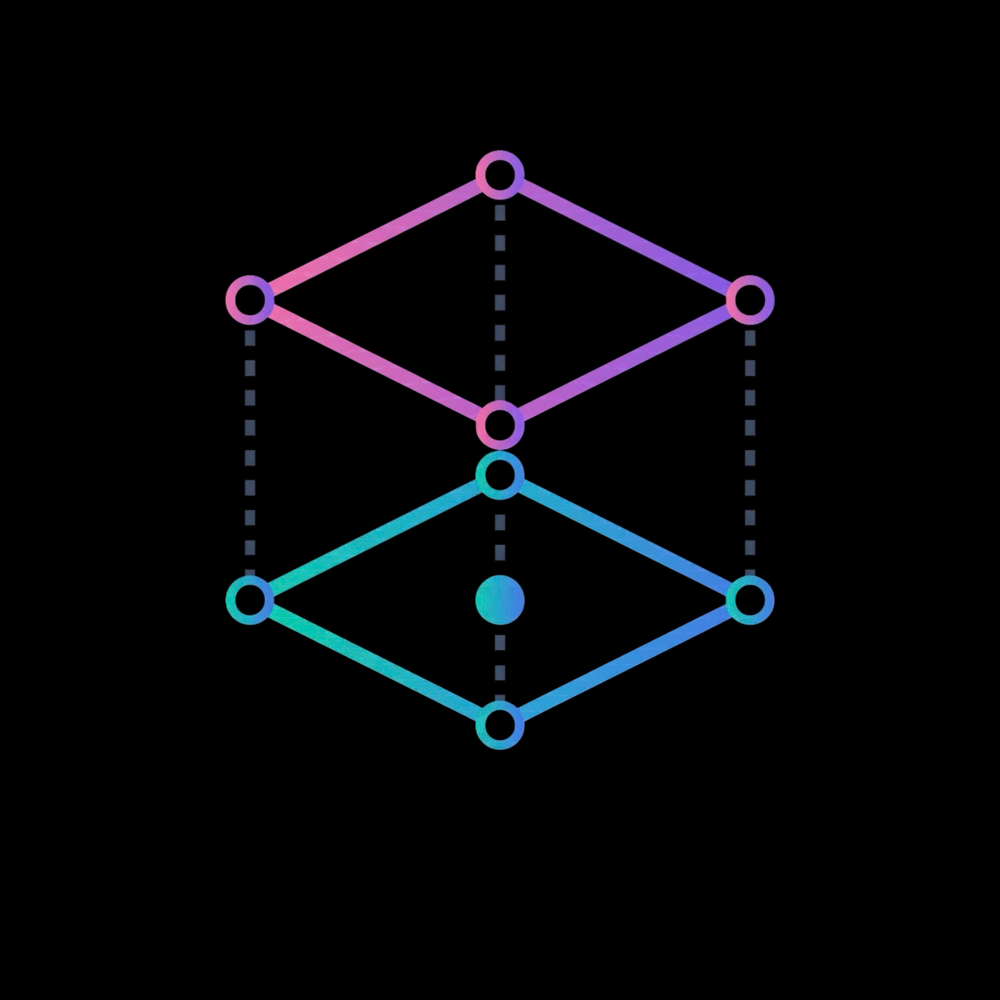

<p align="center">
  
</p>

# Graph Build Tool (GBT)

## 📖 What is GBT?

**Graph Build Tool (GBT)** is a transformative workflow framework designed specifically for graph databases, beginning with **Neo4j**. Inspired by modern analytics engineering practices, GBT brings software engineering principles—such as declarative configurations, modularity, templatization, and version control—into graph data engineering.

**Purpose**: GBT empowers data engineers, graph developers, and analysts to build, maintain, and document graph schemas (DDL) and transform graph data (DML) reliably and efficiently. By defining your graph structures in YAML and your transformations in templated Cypher/SQL, GBT reduces complexity and standardizes graph deployments.

---

## 🚀 Getting Started

### Installation

Install `gbt-core` utilizing `pip` or your favorite Python package manager:

```bash
pip install gbt-core
```

If you are using **Poetry** (as used in this repository):

```bash
poetry add gbt-core
```

### Quick Start

1. **Initialize a Project**: Set up your project structure. (See `example/` for a reference structure including `gbt_project.yaml` and `profiles.yaml`).
2. **Define Models**: Create your node and relationship models inside the `models/` directory using Cypher, SQL, and YAML schemas.
3. **Run Transformations**: Execute the CLI commands to parse, compile, and run your graph models:

```bash
gbt compile
gbt run
```

---

## 🏗 Architecture

<p align="center">
  
</p>

---

## ✨ Current Features

- **Neo4j Native Integration**: A robust Neo4j connector capable of handling complex executions seamlessly.
- **DDL Engine**: Automated Schema Management supporting label operations, index creation, and constraint management defined purely in YAML configurations.
- **DML Engine**: Dynamic data manipulation supporting various materialization strategies including node/relationship **append**, **delete**, and **merge**.
- **Jinja2 Templating**: Leverage Jinja templates (`.cypher.j2`) to build dynamic, reusable, and modular Cypher queries.
- **Manifest Parser**: Advanced compiler that resolves lineage, macros, and dependencies across your `gbt` project into a unified manifest model.
- **Command Line Interface (CLI)**: Intuitive CLI application providing core commands like `gbt compile` and `gbt run`.

---

## 🔮 Future Developments

The journey doesn't stop here. The future roadmap for GBT includes:

- **Multi-Graph Database Support**: Expanding connector capabilities to AWS Neptune, Memgraph, TigerGraph, and more.
- **Data Testing & Quality Checks**: Declarative testing to enforce unique entity constraints, relationship existence, and property data-type validations.
- **Automated Data Lineage UI**: A visual dashboard to explore the dependency graphs (DAG) of the models and relationships.
- **Plugin & Macro Ecosystem**: A package management system allowing the community to share reusable graph algorithm configurations, macros, and transformations.
- **Orchestration Integrations**: Native hooks and operators for popular orchestrators like Apache Airflow, Prefect, and Dagster.
- **Advanced CI/CD Features**: Enhanced slim-CI runs and automatic deployment states.
